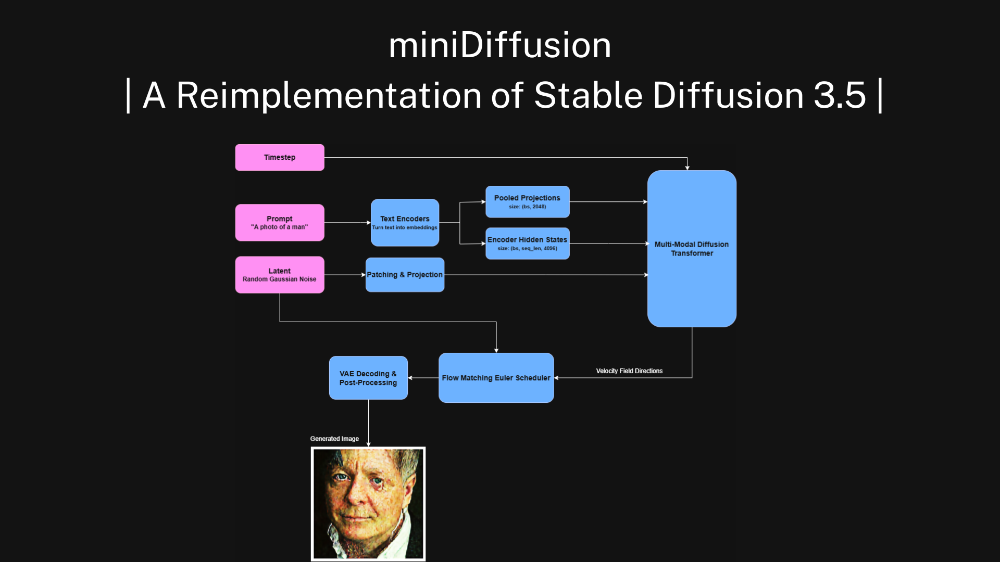

# miniDiffusion



miniDiffusion is a reimplementation of the Stable Diffusion 3.5 model in pure PyTorch with minimal dependencies. It's designed for educational, experimenting, and hacking purposes.
It's made with the mindset of having the least amount of code necessary to recreate Stable Diffusion 3.5 from scratch, with only ~2800 spanning from VAE to DiT to the Train and Dataset scripts.

**-Files:** The main Stable Diffusion model code is located in dit.py, dit_components.py, and attention.py. The dit.py file contains the main model, dit_components.py contains the embedding, normalization, patch embedding, and help functions for the DiT code, and attention.py contains the Joint Attention implementation.
The noise.py is where the Euler Scheduler is located for solving the ODE of Rectified Flow. 

The text encoders are in t5_encoder.py and clip.py, and their tokenizers are both in tokenizer.py. The metrics.py implements the Fréchet inception distance (FID).

The common.py is a place for helper functions for training, the common_ds.py is an implementation of an iterable dataset that converts image data to trainable data for the DiT model.

**-Folders:** The model folder saves the model's checkpoint and logs after training. The encoders folder saves other modules' checkpoints (e.g., VAE, CLIP).

> ⚠️ **Warning**:
> This repository still has experimental features and requires more testing.

## Components

### Core Image Generation Modules
- Implementations of VAE, CLIP, and T5 Text Encoders
- Implementation of Byte-Pair & Unigram tokenizers

### SD3 Components
- Multi-Modal Diffusion Transformer Model
- Flow-Matching Euler Scheduler
- Logit-Normal Sampling
- Joint Attention 

### Train and Inference Scripts For SD3

## Getting Started

Get the repo

```bash
git clone "https://github.com/yousef-rafat/miniDiffusion"
```

Install Dependencies
```bash
pip install -r requirements.txt
```

Install Checkpoints for Models
- *Add a Hugging Face Token in get_checkpoints.py before running the script.*
```bash
python3 encoders/get_checkpoints.py
```

# License

This project is under the MIT License and is made for educational and experimental purposes. 
